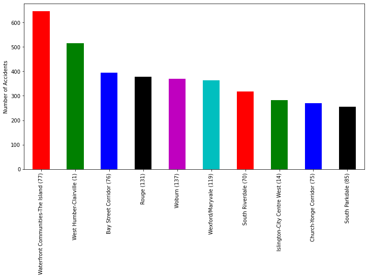

# **Prepare**

## Import


```python
import warnings

import numpy as np
import pandas as pd
import plotly.express as px
import plotly.graph_objects as go
import matplotlib.pyplot as plt


import statsmodels.formula.api as smf
from scipy.stats import norm 
from scipy import stats, integrate

from IPython.display import HTML

!pip install folium
import folium
from folium.plugins import HeatMap
from math import sqrt


from sklearn import neighbors
from sklearn.preprocessing import *
from sklearn.impute import SimpleImputer

!pip install xgboost
from xgboost import XGBClassifier
from sklearn.metrics import *
from sklearn.pipeline import *
from sklearn.utils.validation import check_is_fitted
import seaborn as sns
import matplotlib.pyplot as plt

warnings.simplefilter(action="ignore", category=FutureWarning)
```

    Requirement already satisfied: folium in c:\users\owner\anaconda3\lib\site-packages (0.13.0)
    Requirement already satisfied: requests in c:\users\owner\anaconda3\lib\site-packages (from folium) (2.26.0)
    Requirement already satisfied: branca>=0.3.0 in c:\users\owner\anaconda3\lib\site-packages (from folium) (0.6.0)
    Requirement already satisfied: numpy in c:\users\owner\anaconda3\lib\site-packages (from folium) (1.20.3)
    Requirement already satisfied: jinja2>=2.9 in c:\users\owner\anaconda3\lib\site-packages (from folium) (2.11.3)
    Requirement already satisfied: MarkupSafe>=0.23 in c:\users\owner\anaconda3\lib\site-packages (from jinja2>=2.9->folium) (1.1.1)
    Requirement already satisfied: urllib3<1.27,>=1.21.1 in c:\users\owner\anaconda3\lib\site-packages (from requests->folium) (1.26.7)
    Requirement already satisfied: charset-normalizer~=2.0.0 in c:\users\owner\anaconda3\lib\site-packages (from requests->folium) (2.0.4)
    Requirement already satisfied: certifi>=2017.4.17 in c:\users\owner\anaconda3\lib\site-packages (from requests->folium) (2021.10.8)
    Requirement already satisfied: idna<4,>=2.5 in c:\users\owner\anaconda3\lib\site-packages (from requests->folium) (3.2)
    Requirement already satisfied: xgboost in c:\users\owner\anaconda3\lib\site-packages (1.7.1)
    Requirement already satisfied: numpy in c:\users\owner\anaconda3\lib\site-packages (from xgboost) (1.20.3)
    Requirement already satisfied: scipy in c:\users\owner\anaconda3\lib\site-packages (from xgboost) (1.7.1)
    


```python
def wrangle(path):
    # Read csv file into dataframe
    df = pd.read_csv(path)

    # Select the features
    # df = df[[ 'YEAR', 'DATE', 'TIME', 'HOUR', 'STREET1', 'STREET2', 'ROAD_CLASS', 'DISTRICT', 'LOCCOORD', 'ACCLOC', 'TRAFFCTL', 'VISIBILITY', 'LIGHT',
    # 'RDSFCOND', 'ACCLASS', 'IMPACTYPE', 'INVTYPE', 'INVAGE', 'INJURY', 'INITDIR', 'VEHTYPE', 'MANOEUVER', 'DRIVACT', 'DRIVCOND', 'PEDTYPE', 'PEDACT', 
    # 'PEDCOND',  'PEDESTRIAN', 'CYCLIST', 'AUTOMOBILE', 'MOTORCYCLE', 'TRUCK','TRSN_CITY_VEH', 'EMERG_VEH', 'PASSENGER', 'SPEEDING', 'AG_DRIV', 'REDLIGHT',
    # 'ALCOHOL', 'DISABILITY', 'POLICE_DIVISION','NEIGHBOURHOOD']]
    ## Dropping columns where missing values were greater than 80%
    df = df.drop(["PEDTYPE", "PEDACT", "PEDCOND"], axis=1)
    # Changing the property damage and non-fatal columns to Non-Fatal
    df['ACCLASS'] = np.where(df['ACCLASS'] == 'Property Damage Only', 'Non-Fatal', df['ACCLASS'])
    df['ACCLASS'] = np.where(df['ACCLASS'] == 'Non-Fatal Injury', 'Non-Fatal', df['ACCLASS'])
    
    df['MONTH'] = pd.to_datetime(df['DATE']).dt.month
    df['MONTH_NAME'] = pd.to_datetime(df['DATE']).dt.month_name()
    df['DAY'] = pd.to_datetime(df['DATE']).dt.day
    df['MINUTES'] = pd.to_datetime(df['DATE']).dt.minute
    df['WEEKDAY'] = pd.to_datetime(df['DATE']).dt.weekday


    return df    
```


```python
path = 'KSI DATA.csv'
df = wrangle(path)
print(df.shape)
```

    (16860, 59)
    


```python
df.head()
```


<div>
<style scoped>
    .dataframe tbody tr th:only-of-type {
        vertical-align: middle;
    }

    .dataframe tbody tr th {
        vertical-align: top;
    }

    .dataframe thead th {
        text-align: right;
    }
</style>
<table border="1" class="dataframe">
  <thead>
    <tr style="text-align: right;">
      <th></th>
      <th>X</th>
      <th>Y</th>
      <th>INDEX_</th>
      <th>ACCNUM</th>
      <th>YEAR</th>
      <th>DATE</th>
      <th>TIME</th>
      <th>HOUR</th>
      <th>STREET1</th>
      <th>STREET2</th>
      <th>...</th>
      <th>DISABILITY</th>
      <th>POLICE_DIVISION</th>
      <th>HOOD_ID</th>
      <th>NEIGHBOURHOOD</th>
      <th>ObjectId</th>
      <th>MONTH</th>
      <th>MONTH_NAME</th>
      <th>DAY</th>
      <th>MINUTES</th>
      <th>WEEKDAY</th>
    </tr>
  </thead>
  <tbody>
    <tr>
      <th>0</th>
      <td>-8.844611e+06</td>
      <td>5.412414e+06</td>
      <td>3387730</td>
      <td>892658</td>
      <td>2006</td>
      <td>2006/03/11 05:00:00+00</td>
      <td>852</td>
      <td>8</td>
      <td>BLOOR ST W</td>
      <td>DUNDAS ST W</td>
      <td>...</td>
      <td>No</td>
      <td>D11</td>
      <td>88</td>
      <td>High Park North (88)</td>
      <td>1</td>
      <td>3</td>
      <td>March</td>
      <td>11</td>
      <td>0</td>
      <td>5</td>
    </tr>
    <tr>
      <th>1</th>
      <td>-8.844611e+06</td>
      <td>5.412414e+06</td>
      <td>3387731</td>
      <td>892658</td>
      <td>2006</td>
      <td>2006/03/11 05:00:00+00</td>
      <td>852</td>
      <td>8</td>
      <td>BLOOR ST W</td>
      <td>DUNDAS ST W</td>
      <td>...</td>
      <td>No</td>
      <td>D11</td>
      <td>88</td>
      <td>High Park North (88)</td>
      <td>2</td>
      <td>3</td>
      <td>March</td>
      <td>11</td>
      <td>0</td>
      <td>5</td>
    </tr>
    <tr>
      <th>2</th>
      <td>-8.816480e+06</td>
      <td>5.434843e+06</td>
      <td>3388101</td>
      <td>892810</td>
      <td>2006</td>
      <td>2006/03/11 05:00:00+00</td>
      <td>915</td>
      <td>9</td>
      <td>MORNINGSIDE AVE</td>
      <td>SHEPPARD AVE E</td>
      <td>...</td>
      <td>No</td>
      <td>D42</td>
      <td>131</td>
      <td>Rouge (131)</td>
      <td>3</td>
      <td>3</td>
      <td>March</td>
      <td>11</td>
      <td>0</td>
      <td>5</td>
    </tr>
    <tr>
      <th>3</th>
      <td>-8.816480e+06</td>
      <td>5.434843e+06</td>
      <td>3388102</td>
      <td>892810</td>
      <td>2006</td>
      <td>2006/03/11 05:00:00+00</td>
      <td>915</td>
      <td>9</td>
      <td>MORNINGSIDE AVE</td>
      <td>SHEPPARD AVE E</td>
      <td>...</td>
      <td>No</td>
      <td>D42</td>
      <td>131</td>
      <td>Rouge (131)</td>
      <td>4</td>
      <td>3</td>
      <td>March</td>
      <td>11</td>
      <td>0</td>
      <td>5</td>
    </tr>
    <tr>
      <th>4</th>
      <td>-8.822759e+06</td>
      <td>5.424516e+06</td>
      <td>3387793</td>
      <td>892682</td>
      <td>2006</td>
      <td>2006/03/12 05:00:00+00</td>
      <td>240</td>
      <td>2</td>
      <td>EGLINTON AVE E</td>
      <td>COMMONWEALTH AVE</td>
      <td>...</td>
      <td>No</td>
      <td>D41</td>
      <td>138</td>
      <td>Eglinton East (138)</td>
      <td>5</td>
      <td>3</td>
      <td>March</td>
      <td>12</td>
      <td>0</td>
      <td>6</td>
    </tr>
  </tbody>
</table>
<p>5 rows × 59 columns</p>
</div>


```python
df.describe()
```


<div>
<style scoped>
    .dataframe tbody tr th:only-of-type {
        vertical-align: middle;
    }

    .dataframe tbody tr th {
        vertical-align: top;
    }

    .dataframe thead th {
        text-align: right;
    }
</style>
<table border="1" class="dataframe">
  <thead>
    <tr style="text-align: right;">
      <th></th>
      <th>X</th>
      <th>Y</th>
      <th>INDEX_</th>
      <th>ACCNUM</th>
      <th>YEAR</th>
      <th>TIME</th>
      <th>HOUR</th>
      <th>LATITUDE</th>
      <th>LONGITUDE</th>
      <th>HOOD_ID</th>
      <th>ObjectId</th>
      <th>MONTH</th>
      <th>DAY</th>
      <th>MINUTES</th>
      <th>WEEKDAY</th>
    </tr>
  </thead>
  <tbody>
    <tr>
      <th>count</th>
      <td>1.686000e+04</td>
      <td>1.686000e+04</td>
      <td>1.686000e+04</td>
      <td>1.686000e+04</td>
      <td>16860.000000</td>
      <td>16860.000000</td>
      <td>16860.000000</td>
      <td>16860.000000</td>
      <td>16860.000000</td>
      <td>16860.000000</td>
      <td>16860.000000</td>
      <td>16860.000000</td>
      <td>16860.000000</td>
      <td>16860.0</td>
      <td>16860.000000</td>
    </tr>
    <tr>
      <th>mean</th>
      <td>-8.838272e+06</td>
      <td>5.420819e+06</td>
      <td>3.475220e+07</td>
      <td>2.263460e+09</td>
      <td>2012.256168</td>
      <td>1352.106821</td>
      <td>13.241103</td>
      <td>43.710920</td>
      <td>-79.395546</td>
      <td>74.003618</td>
      <td>8430.500000</td>
      <td>6.802610</td>
      <td>15.617023</td>
      <td>0.0</td>
      <td>3.003796</td>
    </tr>
    <tr>
      <th>std</th>
      <td>1.159490e+04</td>
      <td>8.664361e+03</td>
      <td>3.657126e+07</td>
      <td>3.263836e+09</td>
      <td>4.252797</td>
      <td>629.726747</td>
      <td>6.302679</td>
      <td>0.056254</td>
      <td>0.104159</td>
      <td>41.411541</td>
      <td>4867.207105</td>
      <td>3.288337</td>
      <td>8.847798</td>
      <td>0.0</td>
      <td>1.971048</td>
    </tr>
    <tr>
      <th>min</th>
      <td>-8.865305e+06</td>
      <td>5.402256e+06</td>
      <td>3.363207e+06</td>
      <td>2.530100e+04</td>
      <td>2006.000000</td>
      <td>0.000000</td>
      <td>0.000000</td>
      <td>43.590289</td>
      <td>-79.638390</td>
      <td>1.000000</td>
      <td>1.000000</td>
      <td>1.000000</td>
      <td>1.000000</td>
      <td>0.0</td>
      <td>0.000000</td>
    </tr>
    <tr>
      <th>25%</th>
      <td>-8.846402e+06</td>
      <td>5.413345e+06</td>
      <td>5.358714e+06</td>
      <td>1.065135e+06</td>
      <td>2009.000000</td>
      <td>913.000000</td>
      <td>9.000000</td>
      <td>43.662398</td>
      <td>-79.468578</td>
      <td>39.000000</td>
      <td>4215.750000</td>
      <td>4.000000</td>
      <td>8.000000</td>
      <td>0.0</td>
      <td>1.000000</td>
    </tr>
    <tr>
      <th>50%</th>
      <td>-8.838358e+06</td>
      <td>5.419639e+06</td>
      <td>7.474276e+06</td>
      <td>1.293196e+06</td>
      <td>2012.000000</td>
      <td>1442.000000</td>
      <td>14.000000</td>
      <td>43.703284</td>
      <td>-79.396323</td>
      <td>77.000000</td>
      <td>8430.500000</td>
      <td>7.000000</td>
      <td>16.000000</td>
      <td>0.0</td>
      <td>3.000000</td>
    </tr>
    <tr>
      <th>75%</th>
      <td>-8.829527e+06</td>
      <td>5.427906e+06</td>
      <td>8.063194e+07</td>
      <td>5.001806e+09</td>
      <td>2016.000000</td>
      <td>1845.000000</td>
      <td>18.000000</td>
      <td>43.756945</td>
      <td>-79.316990</td>
      <td>112.000000</td>
      <td>12645.250000</td>
      <td>10.000000</td>
      <td>23.000000</td>
      <td>0.0</td>
      <td>5.000000</td>
    </tr>
    <tr>
      <th>max</th>
      <td>-8.808254e+06</td>
      <td>5.443099e+06</td>
      <td>8.154201e+07</td>
      <td>9.085345e+09</td>
      <td>2020.000000</td>
      <td>2359.000000</td>
      <td>23.000000</td>
      <td>43.855445</td>
      <td>-79.125896</td>
      <td>140.000000</td>
      <td>16860.000000</td>
      <td>12.000000</td>
      <td>31.000000</td>
      <td>0.0</td>
      <td>6.000000</td>
    </tr>
  </tbody>
</table>
</div>


## Explore

### 1. Changing the property damage and non-fatal columns to Non-Fatal


```python
df['ACCLASS'] = np.where(df['ACCLASS'] == 'Property Damage Only', 'Non-Fatal', df['ACCLASS'])
df['ACCLASS'] = np.where(df['ACCLASS'] == 'Non-Fatal Injury', 'Non-Fatal', df['ACCLASS'])
df.ACCLASS.unique()
```


    array(['Fatal', 'Non-Fatal'], dtype=object)


### 2. Accident numbers against years and months


```python
# #Number of Unique accidents by Year
Year_accident = df.groupby('YEAR')['ACCNUM'].nunique().sort_index(ascending=True)
Month_accident = df.groupby('MONTH_NAME')['ACCNUM'].nunique().sort_index(ascending=True)

fig, ax = plt.subplots(2,1,figsize=(19,4))


ax[1].set_title("Accidents caused in different years")
ax[1].set_ylabel('Number of Accidents (ACCNUM)')
ax[1].plot(Year_accident, color='blue')


ax[0].set_title("Accidents caused in different months")
ax[0].set_ylabel('Number of Accidents (ACCNUM)')
ax[0].plot(Month_accident, color='red')

plt.show()
```


    

    


### 3. Fatality Heatmap of those that where Fatally Injured


```python
df_Fatal = df[df['INJURY'] == 'Fatal']
df_Fatal = df_Fatal[['LATITUDE', 'LONGITUDE']]
lat_Toronto_1 = df_Fatal.describe().at['mean','LATITUDE']
lng_Toronto_1 = df_Fatal.describe().at['mean','LONGITUDE']
Toronto_location_F = [lat_Toronto_1, lng_Toronto_1]
Fatal_map_F = folium.Map(Toronto_location_F, zoom_start=10.255)
HeatMap(df_Fatal.values, min_opacity =0.3).add_to(Fatal_map_F)
Fatal_map_F


```


<div style="width:100%;"><div style="position:relative;width:100%;height:0;padding-bottom:60%;"><span style="color:#565656">Make this Notebook Trusted to load map: File -> Trust Notebook</span><iframe srcdoc="&lt;!DOCTYPE html&gt;
&lt;html&gt;
&lt;head&gt;

    &lt;meta http-equiv=&quot;content-type&quot; content=&quot;text/html; charset=UTF-8&quot; /&gt;

        &lt;script&gt;
            L_NO_TOUCH = false;
            L_DISABLE_3D = false;
        &lt;/script&gt;

    &lt;style&gt;html, body {width: 100%;height: 100%;margin: 0;padding: 0;}&lt;/style&gt;
    &lt;style&gt;#map {position:absolute;top:0;bottom:0;right:0;left:0;}&lt;/style&gt;
    &lt;script src=&quot;https://cdn.jsdelivr.net/npm/leaflet@1.6.0/dist/leaflet.js&quot;&gt;&lt;/script&gt;
    &lt;script src=&quot;https://code.jquery.com/jquery-1.12.4.min.js&quot;&gt;&lt;/script&gt;
    &lt;script src=&quot;https://maxcdn.bootstrapcdn.com/bootstrap/3.2.0/js/bootstrap.min.js&quot;&gt;&lt;/script&gt;
    &lt;script src=&quot;https://cdnjs.cloudflare.com/ajax/libs/Leaflet.awesome-markers/2.0.2/leaflet.awesome-markers.js&quot;&gt;&lt;/script&gt;
    &lt;link rel=&quot;stylesheet&quot; href=&quot;https://cdn.jsdelivr.net/npm/leaflet@1.6.0/dist/leaflet.css&quot;/&gt;
    &lt;link rel=&quot;stylesheet&quot; href=&quot;https://maxcdn.bootstrapcdn.com/bootstrap/3.2.0/css/bootstrap.min.css&quot;/&gt;
    &lt;link rel=&quot;stylesheet&quot; href=&quot;https://maxcdn.bootstrapcdn.com/bootstrap/3.2.0/css/bootstrap-theme.min.css&quot;/&gt;
    &lt;link rel=&quot;stylesheet&quot; href=&quot;https://maxcdn.bootstrapcdn.com/font-awesome/4.6.3/css/font-awesome.min.css&quot;/&gt;
    &lt;link rel=&quot;stylesheet&quot; href=&quot;https://cdnjs.cloudflare.com/ajax/libs/Leaflet.awesome-markers/2.0.2/leaflet.awesome-markers.css&quot;/&gt;
    &lt;link rel=&quot;stylesheet&quot; href=&quot;https://cdn.jsdelivr.net/gh/python-visualization/folium/folium/templates/leaflet.awesome.rotate.min.css&quot;/&gt;

            &lt;meta name=&quot;viewport&quot; content=&quot;width=device-width,
                initial-scale=1.0, maximum-scale=1.0, user-scalable=no&quot; /&gt;
            &lt;style&gt;
                #map_16797649dfca80b4712826da66e2873f {
                    position: relative;
                    width: 100.0%;
                    height: 100.0%;
                    left: 0.0%;
                    top: 0.0%;
                }
            &lt;/style&gt;

    &lt;script src=&quot;https://cdn.jsdelivr.net/gh/python-visualization/folium@main/folium/templates/leaflet_heat.min.js&quot;&gt;&lt;/script&gt;
&lt;/head&gt;
&lt;body&gt;


            &lt;div class=&quot;folium-map&quot; id=&quot;map_16797649dfca80b4712826da66e2873f&quot; &gt;&lt;/div&gt;

&lt;/body&gt;
&lt;script&gt;


            var map_16797649dfca80b4712826da66e2873f = L.map(
                &quot;map_16797649dfca80b4712826da66e2873f&quot;,
                {
                    center: [43.71951293300857, -79.39150138611448],
                    crs: L.CRS.EPSG3857,
                    zoom: 10.255,
                    zoomControl: true,
                    preferCanvas: false,
                }
            );


            var tile_layer_8cccfcffb68c86981102b92ac41bcb7a = L.tileLayer(
                &quot;https://{s}.tile.openstreetmap.org/{z}/{x}/{y}.png&quot;,
                {&quot;attribution&quot;: &quot;Data by \u0026copy; \u003ca href=\&quot;http://openstreetmap.org\&quot;\u003eOpenStreetMap\u003c/a\u003e, under \u003ca href=\&quot;http://www.openstreetmap.org/copyright\&quot;\u003eODbL\u003c/a\u003e.&quot;, &quot;detectRetina&quot;: false, &quot;maxNativeZoom&quot;: 18, &quot;maxZoom&quot;: 18, &quot;minZoom&quot;: 0, &quot;noWrap&quot;: false, &quot;opacity&quot;: 1, &quot;subdomains&quot;: &quot;abc&quot;, &quot;tms&quot;: false}
            ).addTo(map_16797649dfca80b4712826da66e2873f);


            var heat_map_fc1466ead3eb0d55d24b2cb1e2fbd885 = L.heatLayer(
                [[43.656345, -79.45249], [43.801943, -79.199786], [43.734945, -79.25619], [43.697045, -79.54669], [43.750745, -79.49259], [43.712345, -79.42809], [43.671645, -79.36609], [43.669945, -79.31119], [43.687345, -79.34469], [43.808145, -79.21999], [43.717145, -79.58259], [43.627745, -79.48149], [43.618845, -79.52039], [43.660445, -79.43239], [43.747045, -79.26339], [43.601245, -79.50299], [43.722245, -79.30709], [43.658345, -79.44269], [43.663745, -79.38409], [43.769845, -79.21869], [43.780145, -79.24379], [43.758345, -79.31299], [43.663245, -79.33019], [43.842745, -79.22479], [43.721445, -79.55809], [43.769445, -79.28229], [43.722045, -79.30799], [43.779345, -79.27559], [43.745345, -79.29469], [43.803445, -79.17069], [43.684045, -79.38349], [43.618245, -79.52439], [43.729145, -79.30449], [43.694445, -79.54549], [43.634645, -79.47159], [43.802045, -79.21779], [43.672145, -79.49399], [43.721545, -79.28499], [43.713045, -79.41179], [43.763445, -79.49099], [43.758145, -79.55959], [43.675345, -79.27639], [43.649845, -79.41829], [43.755245, -79.36049], [43.637945, -79.40389], [43.801945, -79.19979], [43.824745, -79.19059], [43.730445, -79.60139], [43.810745, -79.31209], [43.629745, -79.47859], [43.737345, -79.43409], [43.795845, -79.27219], [43.680545, -79.49759], [43.715945, -79.35349], [43.680445, -79.39099], [43.751145, -79.28629], [43.640645, -79.43649], [43.760345, -79.58349], [43.602645, -79.54319], [43.778746, -79.307887], [43.722245, -79.30359], [43.767545, -79.22839], [43.795945, -79.33269], [43.825945, -79.29729], [43.698445, -79.46349], [43.632645, -79.53159], [43.638945, -79.45759], [43.759345, -79.59689], [43.693245, -79.35029], [43.738745, -79.24919], [43.806045, -79.32219], [43.652345, -79.39779], [43.755945, -79.52429], [43.715945, -79.29899], [43.709445, -79.41079], [43.672145, -79.40599], [43.762845, -79.21109], [43.789145, -79.37329], [43.737645, -79.24369], [43.684345, -79.56499], [43.737545, -79.42059], [43.714745, -79.58519], [43.803145, -79.17689], [43.770045, -79.26129], [43.755345, -79.24609], [43.634545, -79.43879], [43.634545, -79.43879], [43.731545, -79.60189], [43.674243, -79.367488], [43.735245, -79.23669], [43.746245, -79.56859], [43.746245, -79.56859], [43.746245, -79.56859], [43.782145, -79.30349], [43.730245, -79.40359], [43.632745, -79.43379], [43.752045, -79.29749], [43.743645, -79.49179], [43.751145, -79.30649], [43.716345, -79.55349], [43.765745, -79.28109], [43.710945, -79.33479], [43.683045, -79.53259], [43.796045, -79.31849], [43.716245, -79.55869], [43.716245, -79.55869], [43.745345, -79.29469], [43.754845, -79.51709], [43.760445, -79.38659], [43.654945, -79.41559], [43.720645, -79.24259], [43.652445, -79.42199], [43.719145, -79.60349], [43.671345, -79.39019], [43.594345, -79.53399], [43.807745, -79.33239], [43.807745, -79.33239], [43.666945, -79.49949], [43.718745, -79.51839], [43.636045, -79.40189], [43.737945, -79.24239], [43.788445, -79.46399], [43.694745, -79.51949], [43.677645, -79.41219], [43.719645, -79.24709], [43.783245, -79.41639], [43.636344, -79.466892], [43.693645, -79.31159], [43.678245, -79.36889], [43.690045, -79.58279], [43.726145, -79.31829], [43.696745, -79.50589], [43.796545, -79.32309], [43.788245, -79.44669], [43.683345, -79.32359], [43.819445, -79.24579], [43.697345, -79.49899], [43.673945, -79.30789], [43.683645, -79.58019], [43.718145, -79.52109], [43.699245, -79.38669], [43.797945, -79.42009], [43.682045, -79.46649], [43.782745, -79.34909], [43.735545, -79.44269], [43.654345, -79.422687], [43.821345, -79.31689], [43.726445, -79.53559], [43.726445, -79.53559], [43.685545, -79.51249], [43.672345, -79.37959], [43.725945, -79.31939], [43.725945, -79.31939], [43.704245, -79.41029], [43.677146, -79.367893], [43.797845, -79.31619], [43.734645, -79.46599], [43.646327, -79.449046], [43.666346, -79.348491], [43.643445, -79.39129], [43.666245, -79.37829], [43.665345, -79.40999], [43.674045, -79.46319], [43.768945, -79.23769], [43.733745, -79.60669], [43.664945, -79.46439], [43.767745, -79.38309], [43.752045, -79.54239], [43.692745, -79.31589], [43.715644, -79.446491], [43.668845, -79.393192], [43.655845, -79.39919], [43.731845, -79.30559], [43.794845, -79.31499], [43.788645, -79.15869], [43.686945, -79.39979], [43.741845, -79.45429], [43.737845, -79.21059], [43.766535, -79.564769], [43.658045, -79.44399], [43.793045, -79.24249], [43.718745, -79.32799], [43.718745, -79.32799], [43.636445, -79.44399], [43.816847, -79.336452], [43.684645, -79.28029], [43.802245, -79.19869], [43.737045, -79.24619], [43.738145, -79.21779], [43.746845, -79.44449], [43.756945, -79.51989], [43.652745, -79.36319], [43.674445, -79.56319], [43.653845, -79.45179], [43.708445, -79.39019], [43.691345, -79.44849], [43.676145, -79.35889], [43.658545, -79.35139], [43.670745, -79.45329], [43.738945, -79.57999], [43.743245, -79.30459], [43.704645, -79.28869], [43.821345, -79.31689], [43.677945, -79.44309], [43.658744, -79.389987], [43.688645, -79.54289], [43.645845, -79.38629], [43.781545, -79.49449], [43.648545, -79.34989], [43.604745, -79.53139], [43.759545, -79.59529], [43.672745, -79.35879], [43.736045, -79.25879], [43.767645, -79.29229], [43.792445, -79.44049], [43.702545, -79.27699], [43.760345, -79.30449], [43.650445, -79.44189], [43.767545, -79.20709], [43.720945, -79.50859], [43.672345, -79.37689], [43.743245, -79.58209], [43.792645, -79.35469], [43.732245, -79.45799], [43.672945, -79.36929], [43.765745, -79.28109], [43.796645, -79.42629], [43.759245, -79.50789], [43.759245, -79.50789], [43.759245, -79.50789], [43.756345, -79.54349], [43.816945, -79.22429], [43.763845, -79.24839], [43.673945, -79.41469], [43.825345, -79.29999], [43.678645, -79.44329], [43.647245, -79.40389], [43.756845, -79.22939], [43.744145, -79.40669], [43.781245, -79.43289], [43.706645, -79.42669], [43.661745, -79.42689], [43.627345, -79.56239], [43.662445, -79.45589], [43.664344, -79.306186], [43.711345, -79.59279], [43.637945, -79.45899], [43.765745, -79.40909], [43.649045, -79.35619], [43.638445, -79.39219], [43.682945, -79.42839], [43.769045, -79.23759], [43.716845, -79.25989], [43.719145, -79.23929], [43.650945, -79.39729], [43.703245, -79.52599], [43.799145, -79.21289], [43.621845, -79.54319], [43.704845, -79.56349], [43.665745, -79.49119], [43.665745, -79.49119], [43.667145, -79.52009], [43.785945, -79.44589], [43.788945, -79.41779], [43.753945, -79.62099], [43.740245, -79.32799], [43.800545, -79.28489], [43.816245, -79.22759], [43.779645, -79.37889], [43.790045, -79.35519], [43.697045, -79.54669], [43.764346, -79.574893], [43.632643, -79.429286], [43.792345, -79.44589], [43.786906, -79.311565], [43.707345, -79.49739], [43.696145, -79.53269], [43.765445, -79.19949], [43.801245, -79.29659], [43.735545, -79.44279], [43.645445, -79.39499], [43.691545, -79.57079], [43.600445, -79.50639], [43.693845, -79.33849], [43.698545, -79.53989], [43.789345, -79.44389], [43.652745, -79.43739], [43.702145, -79.50359], [43.742645, -79.30729], [43.765898, -79.519672], [43.741145, -79.31929], [43.650645, -79.44299], [43.682345, -79.36239], [43.714145, -79.45329], [43.650045, -79.38629], [43.671546, -79.448291], [43.809645, -79.28999], [43.695545, -79.58959], [43.670245, -79.49319], [43.716945, -79.39359], [43.751645, -79.45669], [43.647745, -79.40369], [43.736445, -79.24899], [43.767646, -79.189586], [43.720045, -79.59679], [43.790545, -79.21259], [43.779545, -79.41639], [43.736845, -79.34499], [43.646245, -79.39819], [43.676943, -79.489391], [43.821345, -79.31689], [43.704245, -79.40049], [43.770245, -79.54649], [43.742343, -79.418292], [43.691545, -79.50099], [43.758245, -79.51239], [43.663245, -79.37259], [43.780945, -79.27089], [43.782045, -79.39149], [43.710745, -79.44449], [43.634787, -79.470248], [43.681845, -79.46769], [43.714343, -79.325488], [43.807944, -79.314189], [43.800745, -79.19929], [43.665145, -79.35589], [43.800245, -79.19909], [43.73416, -79.603069], [43.774943, -79.347888], [43.680644, -79.48479], [43.763743, -79.577289], [43.634444, -79.43909], [43.832644, -79.267993], [43.721343, -79.301288], [43.703646, -79.25159], [43.650244, -79.348491], [43.667243, -79.312587], [43.740344, -79.405887], [43.780545, -79.40669], [43.809844, -79.257686], [43.696154, -79.532726], [43.639426, -79.442485], [43.730746, -79.606792], [43.748545, -79.244487], [43.776445, -79.17369], [43.782345, -79.29219], [43.733845, -79.26859], [43.818743, -79.215091], [43.679843, -79.390689], [43.642996, -79.377811], [43.792746, -79.284488], [43.755545, -79.245387], [43.801444, -79.263789], [43.782145, -79.172488], [43.684645, -79.280292], [43.626245, -79.52879], [43.762446, -79.518886], [43.773146, -79.283893], [43.712046, -79.411693], [43.727843, -79.417888], [43.659644, -79.382388], [43.651843, -79.397586], [43.729346, -79.280689], [43.711943, -79.270191], [43.649745, -79.433688], [43.640547, -79.423999], [43.728645, -79.41439], [43.699229, -79.587123], [43.700518, -79.427753], [43.705802, -79.325069], [43.663043, -79.402095], [43.772868, -79.166332], [43.68751, -79.396922], [43.751868, -79.467212], [43.675994, -79.45193], [43.75495, -79.350871], [43.69625, -79.447673], [43.775088, -79.331226], [43.708708, -79.267062], [43.711142, -79.285129], [43.753844, -79.499591], [43.788844, -79.240093], [43.670146, -79.360187], [43.792533, -79.445163], [43.602343, -79.497989], [43.754172, -79.619815], [43.662455, -79.351352], [43.737418, -79.244701], [43.796965, -79.424747], [43.637614, -79.447742], [43.63444, -79.567218], [43.633544, -79.570766], [43.795355, -79.415706], [43.651168, -79.411594], [43.722369, -79.301685], [43.634032, -79.438045], [43.667643, -79.342792], [43.771441, -79.455066], [43.824481, -79.303623], [43.652507, -79.397853], [43.731745, -79.267787], [43.78575, -79.289455], [43.702246, -79.296924], [43.656085, -79.362254], [43.723372, -79.302089], [43.670558, -79.476505], [43.742972, -79.219852], [43.763236, -79.397456], [43.675116, -79.357845], [43.652541, -79.39986], [43.660464, -79.583576], [43.652262, -79.401134], [43.804114, -79.330722], [43.65729, -79.509113], [43.656863, -79.452602], [43.704775, -79.368121], [43.73503, -79.617862], [43.781047, -79.409702], [43.798106, -79.21767], [43.784381, -79.416683], [43.626292, -79.528835], [43.725703, -79.39442], [43.792666, -79.155994], [43.715346, -79.479564], [43.808852, -79.171031], [43.777014, -79.315486], [43.794638, -79.4192], [43.692526, -79.343501], [43.681033, -79.428859], [43.724711, -79.302638], [43.74869, -79.454883], [43.637427, -79.41212], [43.66582, -79.352763], [43.722663, -79.499889], [43.664443, -79.34238], [43.660933, -79.430408], [43.639189, -79.450557], [43.655574, -79.412013], [43.723372, -79.302089], [43.777968, -79.211902], [43.736033, -79.258769], [43.809378, -79.359485], [43.728129, -79.574641], [43.658259, -79.452983], [43.758048, -79.513431], [43.697508, -79.349437], [43.779742, -79.217136], [43.757712, -79.235263], [43.732985, -79.38129], [43.790801, -79.453021], [43.623171, -79.481792], [43.76113, -79.448695], [43.633349, -79.435138], [43.664164, -79.326206], [43.767913, -79.271098], [43.655329, -79.365749], [43.755538, -79.245418], [43.655387, -79.379863], [43.645896, -79.561664], [43.72959, -79.471462], [43.650695, -79.540759], [43.805159, -79.20087], [43.685214, -79.541393], [43.742171, -79.272052], [43.77582, -79.337749], [43.694125, -79.328006], [43.788577, -79.446666], [43.816252, -79.227596], [43.759272, -79.507922], [43.769263, -79.412891], [43.622645, -79.502467], [43.674712, -79.396594], [43.686812, -79.446643], [43.671626, -79.36584], [43.735163, -79.247379], [43.655169, -79.457828], [43.679423, -79.382312], [43.727645, -79.340846], [43.69047, -79.559459], [43.687525, -79.396793], [43.63745, -79.434711], [43.672331, -79.468509], [43.725997, -79.55511], [43.735335, -79.290637], [43.637053, -79.436572], [43.716307, -79.443202], [43.725833, -79.303104], [43.669097, -79.352985], [43.651801, -79.436343], [43.765433, -79.291316], [43.720404, -79.257442], [43.621562, -79.500606], [43.812129, -79.301936], [43.65774, -79.370799], [43.81296, -79.243068], [43.760417, -79.570071], [43.689231, -79.332736], [43.732192, -79.267925], [43.640692, -79.392284], [43.755103, -79.247493], [43.715674, -79.260387], [43.691016, -79.450549], [43.734461, -79.419765], [43.645873, -79.363429], [43.728129, -79.574641], [43.737166, -79.565257], [43.671199, -79.423724], [43.783583, -79.255756], [43.602278, -79.510753], [43.661376, -79.517581], [43.656932, -79.364993], [43.747851, -79.207637], [43.778243, -79.422359], [43.720599, -79.611308], [43.84878, -79.197955], [43.793151, -79.352275], [43.796763, -79.315753], [43.672747, -79.288913], [43.731806, -79.511264], [43.727339, -79.600063], [43.618773, -79.564426], [43.688113, -79.467433], [43.738375, -79.332294], [43.642066, -79.377452], [43.684897, -79.472804], [43.711352, -79.592754], [43.702868, -79.503825], [43.699485, -79.424945], [43.743716, -79.219142], [43.801421, -79.263774], [43.704074, -79.410945], [43.700984, -79.425548], [43.726615, -79.431415], [43.719248, -79.429813], [43.729457, -79.22742], [43.701564, -79.503444], [43.651473, -79.367008], [43.793151, -79.352275], [43.820227, -79.246181], [43.708262, -79.42094], [43.788653, -79.4099], [43.739379, -79.513202], [43.739379, -79.513202], [43.739379, -79.513202], [43.777732, -79.324161], [43.653998, -79.4864], [43.742285, -79.222949], [43.636099, -79.540073], [43.682341, -79.328265], [43.764498, -79.280681], [43.688357, -79.482868], [43.593039, -79.54156], [43.816844, -79.336467], [43.711028, -79.377147], [43.775893, -79.320316], [43.664706, -79.437427], [43.760321, -79.493961], [43.599963, -79.521175], [43.789603, -79.413997], [43.760237, -79.503604], [43.69353, -79.297221], [43.640776, -79.438091], [43.65372, -79.373241], [43.764662, -79.573322], [43.792651, -79.354724], [43.680724, -79.382404], [43.754729, -79.482974], [43.681227, -79.427661], [43.669959, -79.479152], [43.700667, -79.427036], [43.735331, -79.25436], [43.734049, -79.260188], [43.756446, -79.341022], [43.674712, -79.430972], [43.734519, -79.258098], [43.712084, -79.372058], [43.641406, -79.349178], [43.725642, -79.297504], [43.633078, -79.435222], [43.656096, -79.409488], [43.648158, -79.507747], [43.658221, -79.37099], [43.701213, -79.251239], [43.73202, -79.458873], [43.795336, -79.380786], [43.651316, -79.397403], [43.793753, -79.17908], [43.781909, -79.366107], [43.779303, -79.390872], [43.706267, -79.251254], [43.793505, -79.24007], [43.816607, -79.211665], [43.734515, -79.447238], [43.758727, -79.311122], [43.635432, -79.441371], [43.750491, -79.254108], [43.604773, -79.519672], [43.649821, -79.380771], [43.7396, -79.509639], [43.720431, -79.61201], [43.652056, -79.471744], [43.667636, -79.378894], [43.745097, -79.397746], [43.756312, -79.446689], [43.648974, -79.367259], [43.764189, -79.287677], [43.592673, -79.542079], [43.752017, -79.542331], [43.637957, -79.395633], [43.633498, -79.472667], [43.741065, -79.250186], [43.77949, -79.304355], [43.657778, -79.373676], [43.671935, -79.370654], [43.696753, -79.315616], [43.752669, -79.437747], [43.81116, -79.290668], [43.676146, -79.494518], [43.803004, -79.194843], [43.658351, -79.370532], [43.748763, -79.312076], [43.649501, -79.428958], [43.720442, -79.243045], [43.83705, -79.249019], [43.755641, -79.61288], [43.682852, -79.357181], [43.763491, -79.301257], [43.763491, -79.301257], [43.711009, -79.269771], [43.829547, -79.274997], [43.680995, -79.36806], [43.734023, -79.260021], [43.64926, -79.484439], [43.760802, -79.215762], [43.718589, -79.350383], [43.599353, -79.525653], [43.768195, -79.501659], [43.654326, -79.422664], [43.827811, -79.262767], [43.738906, -79.292102], [43.775355, -79.322238], [43.707171, -79.40327], [43.751868, -79.286601], [43.679961, -79.389858], [43.648543, -79.373821], [43.749583, -79.20592], [43.685427, -79.495136], [43.687686, -79.270885], [43.658187, -79.398158], [43.688479, -79.583987], [43.725032, -79.402156], [43.637709, -79.458881], [43.599005, -79.512874], [43.666098, -79.334277], [43.736342, -79.438586], [43.823569, -79.307048], [43.705172, -79.577121], [43.630515, -79.427158], [43.702281, -79.452075], [43.667445, -79.399799], [43.716773, -79.259883], [43.703868, -79.411601], [43.759535, -79.589862], [43.788287, -79.392772], [43.765391, -79.440891], [43.773322, -79.282741], [43.818522, -79.306857], [43.756827, -79.22932], [43.692008, -79.361987], [43.790507, -79.269923], [43.649542, -79.382091], [43.68162, -79.52972], [43.837935, -79.245151], [43.730475, -79.275096], [43.727904, -79.488223], [43.81428, -79.324542], [43.747714, -79.562267], [43.755549, -79.34798], [43.725344, -79.40224], [43.600909, -79.504077], [43.650427, -79.45827], [43.683169, -79.472026], [43.700686, -79.451724], [43.663325, -79.369693], [43.719565, -79.247051], [43.623107, -79.499957], [43.777663, -79.413097], [43.69797, -79.439349], [43.633887, -79.520046], [43.716109, -79.282733], [43.706175, -79.254787], [43.784983, -79.164645], [43.767378, -79.239131], [43.68439, -79.383662], [43.724532, -79.491092], [43.719008, -79.508113], [43.814105, -79.213535], [43.753218, -79.53622], [43.63795, -79.431827], [43.781508, -79.494464], [43.621218, -79.560214], [43.758383, -79.267612], [43.800383, -79.299571], [43.67512, -79.394153], [43.647521, -79.529773], [43.744177, -79.601718], [43.782229, -79.292499], [43.639567, -79.435504], [43.70674, -79.311771], [43.764414, -79.248561], [43.648467, -79.38531], [43.715869, -79.444942], [43.69525, -79.450084], [43.663756, -79.410678], [43.702204, -79.359363], [43.804152, -79.16875], [43.815394, -79.324634], [43.747695, -79.562312], [43.722941, -79.415889], [43.816447, -79.282207], [43.739615, -79.399722], [43.693389, -79.460269], [43.807639, -79.376056], [43.780181, -79.413204], [43.830973, -79.275157], [43.805499, -79.385745], [43.785277, -79.278529], [43.771086, -79.186321], [43.777281, -79.313861], [43.750846, -79.58575], [43.808352, -79.32191], [43.758837, -79.52151], [43.804576, -79.35551], [43.653163, -79.524646], [43.759955, -79.571773], [43.742396, -79.567699], [43.763796, -79.301395], [43.696955, -79.546672], [43.637206, -79.469287], [43.695372, -79.520099], [43.762419, -79.406253], [43.658515, -79.35094], [43.663294, -79.426227], [43.743407, -79.492511], [43.672286, -79.376811], [43.810782, -79.252879], [43.793036, -79.331371], [43.740718, -79.324664], [43.763205, -79.291911], [43.783148, -79.202258], [43.715853, -79.444942], [43.741534, -79.232578], [43.753451, -79.448032], [43.711005, -79.399272], [43.745886, -79.291835], [43.757247, -79.214244], [43.692488, -79.282268], [43.716452, -79.261302], [43.707354, -79.5647], [43.776141, -79.341129], [43.614146, -79.55611], [43.660288, -79.361743], [43.761779, -79.215801], [43.65261, -79.378055], [43.807952, -79.234142], [43.771643, -79.171214], [43.749427, -79.274898], [43.639434, -79.583965], [43.714133, -79.428554], [43.733508, -79.483684], [43.726, -79.243617], [43.811545, -79.269183], [43.782828, -79.289821], [43.671549, -79.421504], [43.655867, -79.522228], [43.78028, -79.325359], [43.712298, -79.264369], [43.762202, -79.579898], [43.722495, -79.414165], [43.755072, -79.527622], [43.772986, -79.165462], [43.77888, -79.297031], [43.641074, -79.521892], [43.720427, -79.338832], [43.668429, -79.485637], [43.750472, -79.289478], [43.71337, -79.457622], [43.708586, -79.478023], [43.651259, -79.357356], [43.659568, -79.37556], [43.715041, -79.443568], [43.681639, -79.425678], [43.769049, -79.303577], [43.744391, -79.582729], [43.651957, -79.402225], [43.652789, -79.430248], [43.770354, -79.381053], [43.776736, -79.474407], [43.665305, -79.49982], [43.736853, -79.344562], [43.727584, -79.340823], [43.748309, -79.568355], [43.753894, -79.488605], [43.75894, -79.422542], [43.719103, -79.60345], [43.754496, -79.250018], [43.782126, -79.232982], [43.782126, -79.232982], [43.616103, -79.498325], [43.782527, -79.204944], [43.654608, -79.433322], [43.809523, -79.243236], [43.754725, -79.600589], [43.746749, -79.287921], [43.690203, -79.277072], [43.783213, -79.288211], [43.751918, -79.455127], [43.614997, -79.494197], [43.647765, -79.559978], [43.648921, -79.355998], [43.706359, -79.465266]],
                {&quot;blur&quot;: 15, &quot;maxZoom&quot;: 18, &quot;minOpacity&quot;: 0.3, &quot;radius&quot;: 25}
            ).addTo(map_16797649dfca80b4712826da66e2873f);

&lt;/script&gt;
&lt;/html&gt;" style="position:absolute;width:100%;height:100%;left:0;top:0;border:none !important;" allowfullscreen webkitallowfullscreen mozallowfullscreen></iframe></div></div>


### 4. Fatality Heatmap of those that where not Fatally Injured


```python
df_Non_Fatal = df[df['INJURY'] != 'Fatal']
df_Non_Fatal = df_Non_Fatal[['LATITUDE', 'LONGITUDE']]
lat_Toronto_2 = df_Non_Fatal.describe().at['mean','LATITUDE']
lng_Toronto_2 = df_Non_Fatal.describe().at['mean','LONGITUDE']
Toronto_location_N = [lat_Toronto_2, lng_Toronto_2]
Fatal_map_N = folium.Map(Toronto_location_F, zoom_start=10.255)
HeatMap(df_Fatal.values, min_opacity =0.3).add_to(Fatal_map_N)
Fatal_map_N
```


<div style="width:100%;"><div style="position:relative;width:100%;height:0;padding-bottom:60%;"><span style="color:#565656">Make this Notebook Trusted to load map: File -> Trust Notebook</span><iframe srcdoc="&lt;!DOCTYPE html&gt;
&lt;html&gt;
&lt;head&gt;

    &lt;meta http-equiv=&quot;content-type&quot; content=&quot;text/html; charset=UTF-8&quot; /&gt;

        &lt;script&gt;
            L_NO_TOUCH = false;
            L_DISABLE_3D = false;
        &lt;/script&gt;

    &lt;style&gt;html, body {width: 100%;height: 100%;margin: 0;padding: 0;}&lt;/style&gt;
    &lt;style&gt;#map {position:absolute;top:0;bottom:0;right:0;left:0;}&lt;/style&gt;
    &lt;script src=&quot;https://cdn.jsdelivr.net/npm/leaflet@1.6.0/dist/leaflet.js&quot;&gt;&lt;/script&gt;
    &lt;script src=&quot;https://code.jquery.com/jquery-1.12.4.min.js&quot;&gt;&lt;/script&gt;
    &lt;script src=&quot;https://maxcdn.bootstrapcdn.com/bootstrap/3.2.0/js/bootstrap.min.js&quot;&gt;&lt;/script&gt;
    &lt;script src=&quot;https://cdnjs.cloudflare.com/ajax/libs/Leaflet.awesome-markers/2.0.2/leaflet.awesome-markers.js&quot;&gt;&lt;/script&gt;
    &lt;link rel=&quot;stylesheet&quot; href=&quot;https://cdn.jsdelivr.net/npm/leaflet@1.6.0/dist/leaflet.css&quot;/&gt;
    &lt;link rel=&quot;stylesheet&quot; href=&quot;https://maxcdn.bootstrapcdn.com/bootstrap/3.2.0/css/bootstrap.min.css&quot;/&gt;
    &lt;link rel=&quot;stylesheet&quot; href=&quot;https://maxcdn.bootstrapcdn.com/bootstrap/3.2.0/css/bootstrap-theme.min.css&quot;/&gt;
    &lt;link rel=&quot;stylesheet&quot; href=&quot;https://maxcdn.bootstrapcdn.com/font-awesome/4.6.3/css/font-awesome.min.css&quot;/&gt;
    &lt;link rel=&quot;stylesheet&quot; href=&quot;https://cdnjs.cloudflare.com/ajax/libs/Leaflet.awesome-markers/2.0.2/leaflet.awesome-markers.css&quot;/&gt;
    &lt;link rel=&quot;stylesheet&quot; href=&quot;https://cdn.jsdelivr.net/gh/python-visualization/folium/folium/templates/leaflet.awesome.rotate.min.css&quot;/&gt;

            &lt;meta name=&quot;viewport&quot; content=&quot;width=device-width,
                initial-scale=1.0, maximum-scale=1.0, user-scalable=no&quot; /&gt;
            &lt;style&gt;
                #map_cbe4c5e8a65bcecfb84f22aefb5679d6 {
                    position: relative;
                    width: 100.0%;
                    height: 100.0%;
                    left: 0.0%;
                    top: 0.0%;
                }
            &lt;/style&gt;

    &lt;script src=&quot;https://cdn.jsdelivr.net/gh/python-visualization/folium@main/folium/templates/leaflet_heat.min.js&quot;&gt;&lt;/script&gt;
&lt;/head&gt;
&lt;body&gt;


            &lt;div class=&quot;folium-map&quot; id=&quot;map_cbe4c5e8a65bcecfb84f22aefb5679d6&quot; &gt;&lt;/div&gt;

&lt;/body&gt;
&lt;script&gt;


            var map_cbe4c5e8a65bcecfb84f22aefb5679d6 = L.map(
                &quot;map_cbe4c5e8a65bcecfb84f22aefb5679d6&quot;,
                {
                    center: [43.71951293300857, -79.39150138611448],
                    crs: L.CRS.EPSG3857,
                    zoom: 10.255,
                    zoomControl: true,
                    preferCanvas: false,
                }
            );


            var tile_layer_cd22dd638c09053af326812166f8a2f6 = L.tileLayer(
                &quot;https://{s}.tile.openstreetmap.org/{z}/{x}/{y}.png&quot;,
                {&quot;attribution&quot;: &quot;Data by \u0026copy; \u003ca href=\&quot;http://openstreetmap.org\&quot;\u003eOpenStreetMap\u003c/a\u003e, under \u003ca href=\&quot;http://www.openstreetmap.org/copyright\&quot;\u003eODbL\u003c/a\u003e.&quot;, &quot;detectRetina&quot;: false, &quot;maxNativeZoom&quot;: 18, &quot;maxZoom&quot;: 18, &quot;minZoom&quot;: 0, &quot;noWrap&quot;: false, &quot;opacity&quot;: 1, &quot;subdomains&quot;: &quot;abc&quot;, &quot;tms&quot;: false}
            ).addTo(map_cbe4c5e8a65bcecfb84f22aefb5679d6);


            var heat_map_eb84128a918fd86e2ed8f4dfbbe14fa3 = L.heatLayer(
                [[43.656345, -79.45249], [43.801943, -79.199786], [43.734945, -79.25619], [43.697045, -79.54669], [43.750745, -79.49259], [43.712345, -79.42809], [43.671645, -79.36609], [43.669945, -79.31119], [43.687345, -79.34469], [43.808145, -79.21999], [43.717145, -79.58259], [43.627745, -79.48149], [43.618845, -79.52039], [43.660445, -79.43239], [43.747045, -79.26339], [43.601245, -79.50299], [43.722245, -79.30709], [43.658345, -79.44269], [43.663745, -79.38409], [43.769845, -79.21869], [43.780145, -79.24379], [43.758345, -79.31299], [43.663245, -79.33019], [43.842745, -79.22479], [43.721445, -79.55809], [43.769445, -79.28229], [43.722045, -79.30799], [43.779345, -79.27559], [43.745345, -79.29469], [43.803445, -79.17069], [43.684045, -79.38349], [43.618245, -79.52439], [43.729145, -79.30449], [43.694445, -79.54549], [43.634645, -79.47159], [43.802045, -79.21779], [43.672145, -79.49399], [43.721545, -79.28499], [43.713045, -79.41179], [43.763445, -79.49099], [43.758145, -79.55959], [43.675345, -79.27639], [43.649845, -79.41829], [43.755245, -79.36049], [43.637945, -79.40389], [43.801945, -79.19979], [43.824745, -79.19059], [43.730445, -79.60139], [43.810745, -79.31209], [43.629745, -79.47859], [43.737345, -79.43409], [43.795845, -79.27219], [43.680545, -79.49759], [43.715945, -79.35349], [43.680445, -79.39099], [43.751145, -79.28629], [43.640645, -79.43649], [43.760345, -79.58349], [43.602645, -79.54319], [43.778746, -79.307887], [43.722245, -79.30359], [43.767545, -79.22839], [43.795945, -79.33269], [43.825945, -79.29729], [43.698445, -79.46349], [43.632645, -79.53159], [43.638945, -79.45759], [43.759345, -79.59689], [43.693245, -79.35029], [43.738745, -79.24919], [43.806045, -79.32219], [43.652345, -79.39779], [43.755945, -79.52429], [43.715945, -79.29899], [43.709445, -79.41079], [43.672145, -79.40599], [43.762845, -79.21109], [43.789145, -79.37329], [43.737645, -79.24369], [43.684345, -79.56499], [43.737545, -79.42059], [43.714745, -79.58519], [43.803145, -79.17689], [43.770045, -79.26129], [43.755345, -79.24609], [43.634545, -79.43879], [43.634545, -79.43879], [43.731545, -79.60189], [43.674243, -79.367488], [43.735245, -79.23669], [43.746245, -79.56859], [43.746245, -79.56859], [43.746245, -79.56859], [43.782145, -79.30349], [43.730245, -79.40359], [43.632745, -79.43379], [43.752045, -79.29749], [43.743645, -79.49179], [43.751145, -79.30649], [43.716345, -79.55349], [43.765745, -79.28109], [43.710945, -79.33479], [43.683045, -79.53259], [43.796045, -79.31849], [43.716245, -79.55869], [43.716245, -79.55869], [43.745345, -79.29469], [43.754845, -79.51709], [43.760445, -79.38659], [43.654945, -79.41559], [43.720645, -79.24259], [43.652445, -79.42199], [43.719145, -79.60349], [43.671345, -79.39019], [43.594345, -79.53399], [43.807745, -79.33239], [43.807745, -79.33239], [43.666945, -79.49949], [43.718745, -79.51839], [43.636045, -79.40189], [43.737945, -79.24239], [43.788445, -79.46399], [43.694745, -79.51949], [43.677645, -79.41219], [43.719645, -79.24709], [43.783245, -79.41639], [43.636344, -79.466892], [43.693645, -79.31159], [43.678245, -79.36889], [43.690045, -79.58279], [43.726145, -79.31829], [43.696745, -79.50589], [43.796545, -79.32309], [43.788245, -79.44669], [43.683345, -79.32359], [43.819445, -79.24579], [43.697345, -79.49899], [43.673945, -79.30789], [43.683645, -79.58019], [43.718145, -79.52109], [43.699245, -79.38669], [43.797945, -79.42009], [43.682045, -79.46649], [43.782745, -79.34909], [43.735545, -79.44269], [43.654345, -79.422687], [43.821345, -79.31689], [43.726445, -79.53559], [43.726445, -79.53559], [43.685545, -79.51249], [43.672345, -79.37959], [43.725945, -79.31939], [43.725945, -79.31939], [43.704245, -79.41029], [43.677146, -79.367893], [43.797845, -79.31619], [43.734645, -79.46599], [43.646327, -79.449046], [43.666346, -79.348491], [43.643445, -79.39129], [43.666245, -79.37829], [43.665345, -79.40999], [43.674045, -79.46319], [43.768945, -79.23769], [43.733745, -79.60669], [43.664945, -79.46439], [43.767745, -79.38309], [43.752045, -79.54239], [43.692745, -79.31589], [43.715644, -79.446491], [43.668845, -79.393192], [43.655845, -79.39919], [43.731845, -79.30559], [43.794845, -79.31499], [43.788645, -79.15869], [43.686945, -79.39979], [43.741845, -79.45429], [43.737845, -79.21059], [43.766535, -79.564769], [43.658045, -79.44399], [43.793045, -79.24249], [43.718745, -79.32799], [43.718745, -79.32799], [43.636445, -79.44399], [43.816847, -79.336452], [43.684645, -79.28029], [43.802245, -79.19869], [43.737045, -79.24619], [43.738145, -79.21779], [43.746845, -79.44449], [43.756945, -79.51989], [43.652745, -79.36319], [43.674445, -79.56319], [43.653845, -79.45179], [43.708445, -79.39019], [43.691345, -79.44849], [43.676145, -79.35889], [43.658545, -79.35139], [43.670745, -79.45329], [43.738945, -79.57999], [43.743245, -79.30459], [43.704645, -79.28869], [43.821345, -79.31689], [43.677945, -79.44309], [43.658744, -79.389987], [43.688645, -79.54289], [43.645845, -79.38629], [43.781545, -79.49449], [43.648545, -79.34989], [43.604745, -79.53139], [43.759545, -79.59529], [43.672745, -79.35879], [43.736045, -79.25879], [43.767645, -79.29229], [43.792445, -79.44049], [43.702545, -79.27699], [43.760345, -79.30449], [43.650445, -79.44189], [43.767545, -79.20709], [43.720945, -79.50859], [43.672345, -79.37689], [43.743245, -79.58209], [43.792645, -79.35469], [43.732245, -79.45799], [43.672945, -79.36929], [43.765745, -79.28109], [43.796645, -79.42629], [43.759245, -79.50789], [43.759245, -79.50789], [43.759245, -79.50789], [43.756345, -79.54349], [43.816945, -79.22429], [43.763845, -79.24839], [43.673945, -79.41469], [43.825345, -79.29999], [43.678645, -79.44329], [43.647245, -79.40389], [43.756845, -79.22939], [43.744145, -79.40669], [43.781245, -79.43289], [43.706645, -79.42669], [43.661745, -79.42689], [43.627345, -79.56239], [43.662445, -79.45589], [43.664344, -79.306186], [43.711345, -79.59279], [43.637945, -79.45899], [43.765745, -79.40909], [43.649045, -79.35619], [43.638445, -79.39219], [43.682945, -79.42839], [43.769045, -79.23759], [43.716845, -79.25989], [43.719145, -79.23929], [43.650945, -79.39729], [43.703245, -79.52599], [43.799145, -79.21289], [43.621845, -79.54319], [43.704845, -79.56349], [43.665745, -79.49119], [43.665745, -79.49119], [43.667145, -79.52009], [43.785945, -79.44589], [43.788945, -79.41779], [43.753945, -79.62099], [43.740245, -79.32799], [43.800545, -79.28489], [43.816245, -79.22759], [43.779645, -79.37889], [43.790045, -79.35519], [43.697045, -79.54669], [43.764346, -79.574893], [43.632643, -79.429286], [43.792345, -79.44589], [43.786906, -79.311565], [43.707345, -79.49739], [43.696145, -79.53269], [43.765445, -79.19949], [43.801245, -79.29659], [43.735545, -79.44279], [43.645445, -79.39499], [43.691545, -79.57079], [43.600445, -79.50639], [43.693845, -79.33849], [43.698545, -79.53989], [43.789345, -79.44389], [43.652745, -79.43739], [43.702145, -79.50359], [43.742645, -79.30729], [43.765898, -79.519672], [43.741145, -79.31929], [43.650645, -79.44299], [43.682345, -79.36239], [43.714145, -79.45329], [43.650045, -79.38629], [43.671546, -79.448291], [43.809645, -79.28999], [43.695545, -79.58959], [43.670245, -79.49319], [43.716945, -79.39359], [43.751645, -79.45669], [43.647745, -79.40369], [43.736445, -79.24899], [43.767646, -79.189586], [43.720045, -79.59679], [43.790545, -79.21259], [43.779545, -79.41639], [43.736845, -79.34499], [43.646245, -79.39819], [43.676943, -79.489391], [43.821345, -79.31689], [43.704245, -79.40049], [43.770245, -79.54649], [43.742343, -79.418292], [43.691545, -79.50099], [43.758245, -79.51239], [43.663245, -79.37259], [43.780945, -79.27089], [43.782045, -79.39149], [43.710745, -79.44449], [43.634787, -79.470248], [43.681845, -79.46769], [43.714343, -79.325488], [43.807944, -79.314189], [43.800745, -79.19929], [43.665145, -79.35589], [43.800245, -79.19909], [43.73416, -79.603069], [43.774943, -79.347888], [43.680644, -79.48479], [43.763743, -79.577289], [43.634444, -79.43909], [43.832644, -79.267993], [43.721343, -79.301288], [43.703646, -79.25159], [43.650244, -79.348491], [43.667243, -79.312587], [43.740344, -79.405887], [43.780545, -79.40669], [43.809844, -79.257686], [43.696154, -79.532726], [43.639426, -79.442485], [43.730746, -79.606792], [43.748545, -79.244487], [43.776445, -79.17369], [43.782345, -79.29219], [43.733845, -79.26859], [43.818743, -79.215091], [43.679843, -79.390689], [43.642996, -79.377811], [43.792746, -79.284488], [43.755545, -79.245387], [43.801444, -79.263789], [43.782145, -79.172488], [43.684645, -79.280292], [43.626245, -79.52879], [43.762446, -79.518886], [43.773146, -79.283893], [43.712046, -79.411693], [43.727843, -79.417888], [43.659644, -79.382388], [43.651843, -79.397586], [43.729346, -79.280689], [43.711943, -79.270191], [43.649745, -79.433688], [43.640547, -79.423999], [43.728645, -79.41439], [43.699229, -79.587123], [43.700518, -79.427753], [43.705802, -79.325069], [43.663043, -79.402095], [43.772868, -79.166332], [43.68751, -79.396922], [43.751868, -79.467212], [43.675994, -79.45193], [43.75495, -79.350871], [43.69625, -79.447673], [43.775088, -79.331226], [43.708708, -79.267062], [43.711142, -79.285129], [43.753844, -79.499591], [43.788844, -79.240093], [43.670146, -79.360187], [43.792533, -79.445163], [43.602343, -79.497989], [43.754172, -79.619815], [43.662455, -79.351352], [43.737418, -79.244701], [43.796965, -79.424747], [43.637614, -79.447742], [43.63444, -79.567218], [43.633544, -79.570766], [43.795355, -79.415706], [43.651168, -79.411594], [43.722369, -79.301685], [43.634032, -79.438045], [43.667643, -79.342792], [43.771441, -79.455066], [43.824481, -79.303623], [43.652507, -79.397853], [43.731745, -79.267787], [43.78575, -79.289455], [43.702246, -79.296924], [43.656085, -79.362254], [43.723372, -79.302089], [43.670558, -79.476505], [43.742972, -79.219852], [43.763236, -79.397456], [43.675116, -79.357845], [43.652541, -79.39986], [43.660464, -79.583576], [43.652262, -79.401134], [43.804114, -79.330722], [43.65729, -79.509113], [43.656863, -79.452602], [43.704775, -79.368121], [43.73503, -79.617862], [43.781047, -79.409702], [43.798106, -79.21767], [43.784381, -79.416683], [43.626292, -79.528835], [43.725703, -79.39442], [43.792666, -79.155994], [43.715346, -79.479564], [43.808852, -79.171031], [43.777014, -79.315486], [43.794638, -79.4192], [43.692526, -79.343501], [43.681033, -79.428859], [43.724711, -79.302638], [43.74869, -79.454883], [43.637427, -79.41212], [43.66582, -79.352763], [43.722663, -79.499889], [43.664443, -79.34238], [43.660933, -79.430408], [43.639189, -79.450557], [43.655574, -79.412013], [43.723372, -79.302089], [43.777968, -79.211902], [43.736033, -79.258769], [43.809378, -79.359485], [43.728129, -79.574641], [43.658259, -79.452983], [43.758048, -79.513431], [43.697508, -79.349437], [43.779742, -79.217136], [43.757712, -79.235263], [43.732985, -79.38129], [43.790801, -79.453021], [43.623171, -79.481792], [43.76113, -79.448695], [43.633349, -79.435138], [43.664164, -79.326206], [43.767913, -79.271098], [43.655329, -79.365749], [43.755538, -79.245418], [43.655387, -79.379863], [43.645896, -79.561664], [43.72959, -79.471462], [43.650695, -79.540759], [43.805159, -79.20087], [43.685214, -79.541393], [43.742171, -79.272052], [43.77582, -79.337749], [43.694125, -79.328006], [43.788577, -79.446666], [43.816252, -79.227596], [43.759272, -79.507922], [43.769263, -79.412891], [43.622645, -79.502467], [43.674712, -79.396594], [43.686812, -79.446643], [43.671626, -79.36584], [43.735163, -79.247379], [43.655169, -79.457828], [43.679423, -79.382312], [43.727645, -79.340846], [43.69047, -79.559459], [43.687525, -79.396793], [43.63745, -79.434711], [43.672331, -79.468509], [43.725997, -79.55511], [43.735335, -79.290637], [43.637053, -79.436572], [43.716307, -79.443202], [43.725833, -79.303104], [43.669097, -79.352985], [43.651801, -79.436343], [43.765433, -79.291316], [43.720404, -79.257442], [43.621562, -79.500606], [43.812129, -79.301936], [43.65774, -79.370799], [43.81296, -79.243068], [43.760417, -79.570071], [43.689231, -79.332736], [43.732192, -79.267925], [43.640692, -79.392284], [43.755103, -79.247493], [43.715674, -79.260387], [43.691016, -79.450549], [43.734461, -79.419765], [43.645873, -79.363429], [43.728129, -79.574641], [43.737166, -79.565257], [43.671199, -79.423724], [43.783583, -79.255756], [43.602278, -79.510753], [43.661376, -79.517581], [43.656932, -79.364993], [43.747851, -79.207637], [43.778243, -79.422359], [43.720599, -79.611308], [43.84878, -79.197955], [43.793151, -79.352275], [43.796763, -79.315753], [43.672747, -79.288913], [43.731806, -79.511264], [43.727339, -79.600063], [43.618773, -79.564426], [43.688113, -79.467433], [43.738375, -79.332294], [43.642066, -79.377452], [43.684897, -79.472804], [43.711352, -79.592754], [43.702868, -79.503825], [43.699485, -79.424945], [43.743716, -79.219142], [43.801421, -79.263774], [43.704074, -79.410945], [43.700984, -79.425548], [43.726615, -79.431415], [43.719248, -79.429813], [43.729457, -79.22742], [43.701564, -79.503444], [43.651473, -79.367008], [43.793151, -79.352275], [43.820227, -79.246181], [43.708262, -79.42094], [43.788653, -79.4099], [43.739379, -79.513202], [43.739379, -79.513202], [43.739379, -79.513202], [43.777732, -79.324161], [43.653998, -79.4864], [43.742285, -79.222949], [43.636099, -79.540073], [43.682341, -79.328265], [43.764498, -79.280681], [43.688357, -79.482868], [43.593039, -79.54156], [43.816844, -79.336467], [43.711028, -79.377147], [43.775893, -79.320316], [43.664706, -79.437427], [43.760321, -79.493961], [43.599963, -79.521175], [43.789603, -79.413997], [43.760237, -79.503604], [43.69353, -79.297221], [43.640776, -79.438091], [43.65372, -79.373241], [43.764662, -79.573322], [43.792651, -79.354724], [43.680724, -79.382404], [43.754729, -79.482974], [43.681227, -79.427661], [43.669959, -79.479152], [43.700667, -79.427036], [43.735331, -79.25436], [43.734049, -79.260188], [43.756446, -79.341022], [43.674712, -79.430972], [43.734519, -79.258098], [43.712084, -79.372058], [43.641406, -79.349178], [43.725642, -79.297504], [43.633078, -79.435222], [43.656096, -79.409488], [43.648158, -79.507747], [43.658221, -79.37099], [43.701213, -79.251239], [43.73202, -79.458873], [43.795336, -79.380786], [43.651316, -79.397403], [43.793753, -79.17908], [43.781909, -79.366107], [43.779303, -79.390872], [43.706267, -79.251254], [43.793505, -79.24007], [43.816607, -79.211665], [43.734515, -79.447238], [43.758727, -79.311122], [43.635432, -79.441371], [43.750491, -79.254108], [43.604773, -79.519672], [43.649821, -79.380771], [43.7396, -79.509639], [43.720431, -79.61201], [43.652056, -79.471744], [43.667636, -79.378894], [43.745097, -79.397746], [43.756312, -79.446689], [43.648974, -79.367259], [43.764189, -79.287677], [43.592673, -79.542079], [43.752017, -79.542331], [43.637957, -79.395633], [43.633498, -79.472667], [43.741065, -79.250186], [43.77949, -79.304355], [43.657778, -79.373676], [43.671935, -79.370654], [43.696753, -79.315616], [43.752669, -79.437747], [43.81116, -79.290668], [43.676146, -79.494518], [43.803004, -79.194843], [43.658351, -79.370532], [43.748763, -79.312076], [43.649501, -79.428958], [43.720442, -79.243045], [43.83705, -79.249019], [43.755641, -79.61288], [43.682852, -79.357181], [43.763491, -79.301257], [43.763491, -79.301257], [43.711009, -79.269771], [43.829547, -79.274997], [43.680995, -79.36806], [43.734023, -79.260021], [43.64926, -79.484439], [43.760802, -79.215762], [43.718589, -79.350383], [43.599353, -79.525653], [43.768195, -79.501659], [43.654326, -79.422664], [43.827811, -79.262767], [43.738906, -79.292102], [43.775355, -79.322238], [43.707171, -79.40327], [43.751868, -79.286601], [43.679961, -79.389858], [43.648543, -79.373821], [43.749583, -79.20592], [43.685427, -79.495136], [43.687686, -79.270885], [43.658187, -79.398158], [43.688479, -79.583987], [43.725032, -79.402156], [43.637709, -79.458881], [43.599005, -79.512874], [43.666098, -79.334277], [43.736342, -79.438586], [43.823569, -79.307048], [43.705172, -79.577121], [43.630515, -79.427158], [43.702281, -79.452075], [43.667445, -79.399799], [43.716773, -79.259883], [43.703868, -79.411601], [43.759535, -79.589862], [43.788287, -79.392772], [43.765391, -79.440891], [43.773322, -79.282741], [43.818522, -79.306857], [43.756827, -79.22932], [43.692008, -79.361987], [43.790507, -79.269923], [43.649542, -79.382091], [43.68162, -79.52972], [43.837935, -79.245151], [43.730475, -79.275096], [43.727904, -79.488223], [43.81428, -79.324542], [43.747714, -79.562267], [43.755549, -79.34798], [43.725344, -79.40224], [43.600909, -79.504077], [43.650427, -79.45827], [43.683169, -79.472026], [43.700686, -79.451724], [43.663325, -79.369693], [43.719565, -79.247051], [43.623107, -79.499957], [43.777663, -79.413097], [43.69797, -79.439349], [43.633887, -79.520046], [43.716109, -79.282733], [43.706175, -79.254787], [43.784983, -79.164645], [43.767378, -79.239131], [43.68439, -79.383662], [43.724532, -79.491092], [43.719008, -79.508113], [43.814105, -79.213535], [43.753218, -79.53622], [43.63795, -79.431827], [43.781508, -79.494464], [43.621218, -79.560214], [43.758383, -79.267612], [43.800383, -79.299571], [43.67512, -79.394153], [43.647521, -79.529773], [43.744177, -79.601718], [43.782229, -79.292499], [43.639567, -79.435504], [43.70674, -79.311771], [43.764414, -79.248561], [43.648467, -79.38531], [43.715869, -79.444942], [43.69525, -79.450084], [43.663756, -79.410678], [43.702204, -79.359363], [43.804152, -79.16875], [43.815394, -79.324634], [43.747695, -79.562312], [43.722941, -79.415889], [43.816447, -79.282207], [43.739615, -79.399722], [43.693389, -79.460269], [43.807639, -79.376056], [43.780181, -79.413204], [43.830973, -79.275157], [43.805499, -79.385745], [43.785277, -79.278529], [43.771086, -79.186321], [43.777281, -79.313861], [43.750846, -79.58575], [43.808352, -79.32191], [43.758837, -79.52151], [43.804576, -79.35551], [43.653163, -79.524646], [43.759955, -79.571773], [43.742396, -79.567699], [43.763796, -79.301395], [43.696955, -79.546672], [43.637206, -79.469287], [43.695372, -79.520099], [43.762419, -79.406253], [43.658515, -79.35094], [43.663294, -79.426227], [43.743407, -79.492511], [43.672286, -79.376811], [43.810782, -79.252879], [43.793036, -79.331371], [43.740718, -79.324664], [43.763205, -79.291911], [43.783148, -79.202258], [43.715853, -79.444942], [43.741534, -79.232578], [43.753451, -79.448032], [43.711005, -79.399272], [43.745886, -79.291835], [43.757247, -79.214244], [43.692488, -79.282268], [43.716452, -79.261302], [43.707354, -79.5647], [43.776141, -79.341129], [43.614146, -79.55611], [43.660288, -79.361743], [43.761779, -79.215801], [43.65261, -79.378055], [43.807952, -79.234142], [43.771643, -79.171214], [43.749427, -79.274898], [43.639434, -79.583965], [43.714133, -79.428554], [43.733508, -79.483684], [43.726, -79.243617], [43.811545, -79.269183], [43.782828, -79.289821], [43.671549, -79.421504], [43.655867, -79.522228], [43.78028, -79.325359], [43.712298, -79.264369], [43.762202, -79.579898], [43.722495, -79.414165], [43.755072, -79.527622], [43.772986, -79.165462], [43.77888, -79.297031], [43.641074, -79.521892], [43.720427, -79.338832], [43.668429, -79.485637], [43.750472, -79.289478], [43.71337, -79.457622], [43.708586, -79.478023], [43.651259, -79.357356], [43.659568, -79.37556], [43.715041, -79.443568], [43.681639, -79.425678], [43.769049, -79.303577], [43.744391, -79.582729], [43.651957, -79.402225], [43.652789, -79.430248], [43.770354, -79.381053], [43.776736, -79.474407], [43.665305, -79.49982], [43.736853, -79.344562], [43.727584, -79.340823], [43.748309, -79.568355], [43.753894, -79.488605], [43.75894, -79.422542], [43.719103, -79.60345], [43.754496, -79.250018], [43.782126, -79.232982], [43.782126, -79.232982], [43.616103, -79.498325], [43.782527, -79.204944], [43.654608, -79.433322], [43.809523, -79.243236], [43.754725, -79.600589], [43.746749, -79.287921], [43.690203, -79.277072], [43.783213, -79.288211], [43.751918, -79.455127], [43.614997, -79.494197], [43.647765, -79.559978], [43.648921, -79.355998], [43.706359, -79.465266]],
                {&quot;blur&quot;: 15, &quot;maxZoom&quot;: 18, &quot;minOpacity&quot;: 0.3, &quot;radius&quot;: 25}
            ).addTo(map_cbe4c5e8a65bcecfb84f22aefb5679d6);

&lt;/script&gt;
&lt;/html&gt;" style="position:absolute;width:100%;height:100%;left:0;top:0;border:none !important;" allowfullscreen webkitallowfullscreen mozallowfullscreen></iframe></div></div>


### 5. Fatality over years (# of people died)


```python
#Lets look at Fatality over years (# of people died)
Fatality = df[df['INJURY'] =='Fatal']
Fatality = Fatality.groupby(df['YEAR']).count()
plt.figure(figsize=(12,6))


plt.ylabel('Number of Injury=Fatal')
Fatality['INJURY'].plot(kind='bar',color="y" , edgecolor='black')

plt.show()
```


    

    


### 6. Looking at area where accident happens


```python
Region_df = df['DISTRICT'].value_counts()
plt.figure(figsize=(12,6))
plt.ylabel('Number of Accidents')
Region_df.plot(kind='bar',color=list('rgbkmc') )
plt.show()
```


    

    


### 7. Top 10 Neighbourhood with Most collisions


```python
Hood_df = df['NEIGHBOURHOOD'].value_counts()
plt.figure(figsize=(12,6))
plt.ylabel('Number of Accidents')
Hood_df.nlargest(10).plot(kind='bar',color=list('rgbkmc') )
plt.show()
```


    

    


```python
def conut_feature(df, xlabel, title):
    ax = sns.countplot(x=df)

    plt.xticks(size=12)
    plt.xlabel(xlabel, size=14)
    plt.yticks(size=12)
    plt.ylabel('Number of Traffic Collisions', size=12)
    plt.title(title, size=16)
    ax.set_xticklabels(ax.get_xticklabels(), rotation=40, ha="right")

    total = len(df)
    for p in ax.patches:
        percentage = f'{100 * p.get_height() / total:.2f}%\n'
        x = p.get_x() + p.get_width() / 2
        y = p.get_height()
        ax.annotate(percentage, (x, y), ha='center', va='center')
    plt.tight_layout()
    plt.show()
```


```python
# What is the percentage of OUTCOME?
conut_feature(df['ACCLASS'], 'Outcome', 'Collision Outcome')
```


    

    


```python

conut_feature(df['ROAD_CLASS'], 'level of road classes',"Road Collision")

```


    

    


### Data cleaning


```python
df_clean_data = df[['ACCNUM', 'YEAR', 'MONTH', 'DAY', 'HOUR', 'MINUTES', 'WEEKDAY', 'LATITUDE', 'LONGITUDE', 
'DISTRICT', 'VISIBILITY', 'LIGHT', 'RDSFCOND', 'PEDESTRIAN', 'CYCLIST', 'AUTOMOBILE', 'MOTORCYCLE', 'TRUCK', 
    'TRSN_CITY_VEH', 'EMERG_VEH', 'PASSENGER', 'SPEEDING', 'AG_DRIV', 'REDLIGHT', 'ALCOHOL', 'DISABILITY', 'ACCLASS']]

# Transforming the coordinates
df_clean_data['LATITUDE'] = df_clean_data['LATITUDE'].astype('int')
df_clean_data['LONGITUDE'] = df_clean_data['LATITUDE'].astype('int')
```

    C:\Users\owner\AppData\Local\Temp/ipykernel_23284/2944973631.py:6: SettingWithCopyWarning: 
    A value is trying to be set on a copy of a slice from a DataFrame.
    Try using .loc[row_indexer,col_indexer] = value instead
    
    See the caveats in the documentation: https://pandas.pydata.org/pandas-docs/stable/user_guide/indexing.html#returning-a-view-versus-a-copy
      df_clean_data['LATITUDE'] = df_clean_data['LATITUDE'].astype('int')
    C:\Users\owner\AppData\Local\Temp/ipykernel_23284/2944973631.py:7: SettingWithCopyWarning: 
    A value is trying to be set on a copy of a slice from a DataFrame.
    Try using .loc[row_indexer,col_indexer] = value instead
    
    See the caveats in the documentation: https://pandas.pydata.org/pandas-docs/stable/user_guide/indexing.html#returning-a-view-versus-a-copy
      df_clean_data['LONGITUDE'] = df_clean_data['LATITUDE'].astype('int')
    


```python
print("Percentage of missing values in the KSI_CLEAN_data dataset")
df_clean_data.isna().sum()/len(df_clean_data)*100
```

    Percentage of missing values in the KSI_CLEAN_data dataset
    


    ACCNUM           0.0
    YEAR             0.0
    MONTH            0.0
    DAY              0.0
    HOUR             0.0
    MINUTES          0.0
    WEEKDAY          0.0
    LATITUDE         0.0
    LONGITUDE        0.0
    DISTRICT         0.0
    VISIBILITY       0.0
    LIGHT            0.0
    RDSFCOND         0.0
    PEDESTRIAN       0.0
    CYCLIST          0.0
    AUTOMOBILE       0.0
    MOTORCYCLE       0.0
    TRUCK            0.0
    TRSN_CITY_VEH    0.0
    EMERG_VEH        0.0
    PASSENGER        0.0
    SPEEDING         0.0
    AG_DRIV          0.0
    REDLIGHT         0.0
    ALCOHOL          0.0
    DISABILITY       0.0
    ACCLASS          0.0
    dtype: float64


#### Encoding


```python
df_clean_data = pd.get_dummies(df_clean_data, columns=['VISIBILITY','RDSFCOND','LIGHT','DISTRICT','PEDESTRIAN','CYCLIST', 'AUTOMOBILE', 'MOTORCYCLE', 'TRUCK', 
    'TRSN_CITY_VEH', 'EMERG_VEH', 'PASSENGER', 'SPEEDING', 'AG_DRIV', 'REDLIGHT', 'ALCOHOL', 'DISABILITY'])

df_clean_data.info()
```

    <class 'pandas.core.frame.DataFrame'>
    RangeIndex: 16860 entries, 0 to 16859
    Data columns (total 70 columns):
     #   Column                             Non-Null Count  Dtype 
    ---  ------                             --------------  ----- 
     0   ACCNUM                             16860 non-null  int64 
     1   YEAR                               16860 non-null  int64 
     2   MONTH                              16860 non-null  int64 
     3   DAY                                16860 non-null  int64 
     4   HOUR                               16860 non-null  int64 
     5   MINUTES                            16860 non-null  int64 
     6   WEEKDAY                            16860 non-null  int64 
     7   LATITUDE                           16860 non-null  int32 
     8   LONGITUDE                          16860 non-null  int32 
     9   ACCLASS                            16860 non-null  object
     10  VISIBILITY_Clear                   16860 non-null  uint8 
     11  VISIBILITY_Drifting Snow           16860 non-null  uint8 
     12  VISIBILITY_Fog, Mist, Smoke, Dust  16860 non-null  uint8 
     13  VISIBILITY_Freezing Rain           16860 non-null  uint8 
     14  VISIBILITY_No                      16860 non-null  uint8 
     15  VISIBILITY_Other                   16860 non-null  uint8 
     16  VISIBILITY_Rain                    16860 non-null  uint8 
     17  VISIBILITY_Snow                    16860 non-null  uint8 
     18  VISIBILITY_Strong wind             16860 non-null  uint8 
     19  RDSFCOND_Dry                       16860 non-null  uint8 
     20  RDSFCOND_Ice                       16860 non-null  uint8 
     21  RDSFCOND_Loose Sand or Gravel      16860 non-null  uint8 
     22  RDSFCOND_Loose Snow                16860 non-null  uint8 
     23  RDSFCOND_No                        16860 non-null  uint8 
     24  RDSFCOND_Other                     16860 non-null  uint8 
     25  RDSFCOND_Packed Snow               16860 non-null  uint8 
     26  RDSFCOND_Slush                     16860 non-null  uint8 
     27  RDSFCOND_Spilled liquid            16860 non-null  uint8 
     28  RDSFCOND_Wet                       16860 non-null  uint8 
     29  LIGHT_Dark                         16860 non-null  uint8 
     30  LIGHT_Dark, artificial             16860 non-null  uint8 
     31  LIGHT_Dawn                         16860 non-null  uint8 
     32  LIGHT_Dawn, artificial             16860 non-null  uint8 
     33  LIGHT_Daylight                     16860 non-null  uint8 
     34  LIGHT_Daylight, artificial         16860 non-null  uint8 
     35  LIGHT_Dusk                         16860 non-null  uint8 
     36  LIGHT_Dusk, artificial             16860 non-null  uint8 
     37  LIGHT_Other                        16860 non-null  uint8 
     38  DISTRICT_Etobicoke York            16860 non-null  uint8 
     39  DISTRICT_No                        16860 non-null  uint8 
     40  DISTRICT_North York                16860 non-null  uint8 
     41  DISTRICT_Scarborough               16860 non-null  uint8 
     42  DISTRICT_Toronto East York         16860 non-null  uint8 
     43  DISTRICT_Toronto and East York     16860 non-null  uint8 
     44  PEDESTRIAN_No                      16860 non-null  uint8 
     45  PEDESTRIAN_Yes                     16860 non-null  uint8 
     46  CYCLIST_No                         16860 non-null  uint8 
     47  CYCLIST_Yes                        16860 non-null  uint8 
     48  AUTOMOBILE_No                      16860 non-null  uint8 
     49  AUTOMOBILE_Yes                     16860 non-null  uint8 
     50  MOTORCYCLE_No                      16860 non-null  uint8 
     51  MOTORCYCLE_Yes                     16860 non-null  uint8 
     52  TRUCK_No                           16860 non-null  uint8 
     53  TRUCK_Yes                          16860 non-null  uint8 
     54  TRSN_CITY_VEH_No                   16860 non-null  uint8 
     55  TRSN_CITY_VEH_Yes                  16860 non-null  uint8 
     56  EMERG_VEH_No                       16860 non-null  uint8 
     57  EMERG_VEH_Yes                      16860 non-null  uint8 
     58  PASSENGER_No                       16860 non-null  uint8 
     59  PASSENGER_Yes                      16860 non-null  uint8 
     60  SPEEDING_No                        16860 non-null  uint8 
     61  SPEEDING_Yes                       16860 non-null  uint8 
     62  AG_DRIV_No                         16860 non-null  uint8 
     63  AG_DRIV_Yes                        16860 non-null  uint8 
     64  REDLIGHT_No                        16860 non-null  uint8 
     65  REDLIGHT_Yes                       16860 non-null  uint8 
     66  ALCOHOL_No                         16860 non-null  uint8 
     67  ALCOHOL_Yes                        16860 non-null  uint8 
     68  DISABILITY_No                      16860 non-null  uint8 
     69  DISABILITY_Yes                     16860 non-null  uint8 
    dtypes: int32(2), int64(7), object(1), uint8(60)
    memory usage: 2.1+ MB
    

### Finding Important features


```python
X = df_clean_data.drop('ACCLASS', axis=1)
y = df_clean_data['ACCLASS']    #target column i.e price range

from sklearn.ensemble import ExtraTreesClassifier
import matplotlib.pyplot as plt
model = ExtraTreesClassifier()
model.fit(X,y)
 #use inbuilt class feature_importances of tree based classifiers
#plot graph of feature importances for better visualization
feat_importances = pd.Series(model.feature_importances_, index=X.columns)
feat_importances.nlargest(15).plot(kind='barh')
plt.show()
```


    

    


```python
feat_importances.sort_values(ascending=False)[:10]
```


    ACCNUM                  0.116754
    DAY                     0.105663
    HOUR                    0.098005
    MONTH                   0.097100
    YEAR                    0.090944
    WEEKDAY                 0.088437
    PASSENGER_Yes           0.019576
    DISTRICT_Scarborough    0.019109
    PASSENGER_No            0.018746
    LIGHT_Daylight          0.018643
    dtype: float64


```python
df_clean_data.info()
```

    <class 'pandas.core.frame.DataFrame'>
    RangeIndex: 16860 entries, 0 to 16859
    Data columns (total 70 columns):
     #   Column                             Non-Null Count  Dtype 
    ---  ------                             --------------  ----- 
     0   ACCNUM                             16860 non-null  int64 
     1   YEAR                               16860 non-null  int64 
     2   MONTH                              16860 non-null  int64 
     3   DAY                                16860 non-null  int64 
     4   HOUR                               16860 non-null  int64 
     5   MINUTES                            16860 non-null  int64 
     6   WEEKDAY                            16860 non-null  int64 
     7   LATITUDE                           16860 non-null  int32 
     8   LONGITUDE                          16860 non-null  int32 
     9   ACCLASS                            16860 non-null  object
     10  VISIBILITY_Clear                   16860 non-null  uint8 
     11  VISIBILITY_Drifting Snow           16860 non-null  uint8 
     12  VISIBILITY_Fog, Mist, Smoke, Dust  16860 non-null  uint8 
     13  VISIBILITY_Freezing Rain           16860 non-null  uint8 
     14  VISIBILITY_No                      16860 non-null  uint8 
     15  VISIBILITY_Other                   16860 non-null  uint8 
     16  VISIBILITY_Rain                    16860 non-null  uint8 
     17  VISIBILITY_Snow                    16860 non-null  uint8 
     18  VISIBILITY_Strong wind             16860 non-null  uint8 
     19  RDSFCOND_Dry                       16860 non-null  uint8 
     20  RDSFCOND_Ice                       16860 non-null  uint8 
     21  RDSFCOND_Loose Sand or Gravel      16860 non-null  uint8 
     22  RDSFCOND_Loose Snow                16860 non-null  uint8 
     23  RDSFCOND_No                        16860 non-null  uint8 
     24  RDSFCOND_Other                     16860 non-null  uint8 
     25  RDSFCOND_Packed Snow               16860 non-null  uint8 
     26  RDSFCOND_Slush                     16860 non-null  uint8 
     27  RDSFCOND_Spilled liquid            16860 non-null  uint8 
     28  RDSFCOND_Wet                       16860 non-null  uint8 
     29  LIGHT_Dark                         16860 non-null  uint8 
     30  LIGHT_Dark, artificial             16860 non-null  uint8 
     31  LIGHT_Dawn                         16860 non-null  uint8 
     32  LIGHT_Dawn, artificial             16860 non-null  uint8 
     33  LIGHT_Daylight                     16860 non-null  uint8 
     34  LIGHT_Daylight, artificial         16860 non-null  uint8 
     35  LIGHT_Dusk                         16860 non-null  uint8 
     36  LIGHT_Dusk, artificial             16860 non-null  uint8 
     37  LIGHT_Other                        16860 non-null  uint8 
     38  DISTRICT_Etobicoke York            16860 non-null  uint8 
     39  DISTRICT_No                        16860 non-null  uint8 
     40  DISTRICT_North York                16860 non-null  uint8 
     41  DISTRICT_Scarborough               16860 non-null  uint8 
     42  DISTRICT_Toronto East York         16860 non-null  uint8 
     43  DISTRICT_Toronto and East York     16860 non-null  uint8 
     44  PEDESTRIAN_No                      16860 non-null  uint8 
     45  PEDESTRIAN_Yes                     16860 non-null  uint8 
     46  CYCLIST_No                         16860 non-null  uint8 
     47  CYCLIST_Yes                        16860 non-null  uint8 
     48  AUTOMOBILE_No                      16860 non-null  uint8 
     49  AUTOMOBILE_Yes                     16860 non-null  uint8 
     50  MOTORCYCLE_No                      16860 non-null  uint8 
     51  MOTORCYCLE_Yes                     16860 non-null  uint8 
     52  TRUCK_No                           16860 non-null  uint8 
     53  TRUCK_Yes                          16860 non-null  uint8 
     54  TRSN_CITY_VEH_No                   16860 non-null  uint8 
     55  TRSN_CITY_VEH_Yes                  16860 non-null  uint8 
     56  EMERG_VEH_No                       16860 non-null  uint8 
     57  EMERG_VEH_Yes                      16860 non-null  uint8 
     58  PASSENGER_No                       16860 non-null  uint8 
     59  PASSENGER_Yes                      16860 non-null  uint8 
     60  SPEEDING_No                        16860 non-null  uint8 
     61  SPEEDING_Yes                       16860 non-null  uint8 
     62  AG_DRIV_No                         16860 non-null  uint8 
     63  AG_DRIV_Yes                        16860 non-null  uint8 
     64  REDLIGHT_No                        16860 non-null  uint8 
     65  REDLIGHT_Yes                       16860 non-null  uint8 
     66  ALCOHOL_No                         16860 non-null  uint8 
     67  ALCOHOL_Yes                        16860 non-null  uint8 
     68  DISABILITY_No                      16860 non-null  uint8 
     69  DISABILITY_Yes                     16860 non-null  uint8 
    dtypes: int32(2), int64(7), object(1), uint8(60)
    memory usage: 2.1+ MB
    

## Split


```python
target = 'ACCLASS'
X = df_clean_data.drop(target, axis=1)
y = df_clean_data[target].map({'Fatal':1,'Non-Fatal':0})
```


```python
from sklearn.model_selection import train_test_split

X_train, X_test, y_train, y_test = train_test_split(X, y, test_size=0.30, random_state=42)
```

# **Build Model**

## Model 1 - XGBoost Classifier


```python
model_1 = make_pipeline(
    StandardScaler(),
    SimpleImputer(),
    XGBClassifier(),
)
model_1.fit(X_train, y_train)
```


    Pipeline(steps=[('standardscaler', StandardScaler()),
                    ('simpleimputer', SimpleImputer()),
                    ('xgbclassifier',
                     XGBClassifier(base_score=0.5, booster='gbtree', callbacks=None,
                                   colsample_bylevel=1, colsample_bynode=1,
                                   colsample_bytree=1, early_stopping_rounds=None,
                                   enable_categorical=False, eval_metric=None,
                                   feature_types=None, gamma=0, gpu_id=-1,
                                   grow_policy='depthwise', importance_type=None,
                                   interaction_constraints='',
                                   learning_rate=0.300000012, max_bin=256,
                                   max_cat_threshold=64, max_cat_to_onehot=4,
                                   max_delta_step=0, max_depth=6, max_leaves=0,
                                   min_child_weight=1, missing=nan,
                                   monotone_constraints='()', n_estimators=100,
                                   n_jobs=0, num_parallel_tree=1, predictor='auto',
                                   random_state=0, ...))])


```python
model_1_pred = model_1.predict(X_test)
model_1_acc = accuracy_score(y_test, model_1_pred)
print(f'Model Accuracy: {model_1_acc}')
print(classification_report(y_test, model_1_pred))
```

    Model Accuracy: 0.9396994859628311
                  precision    recall  f1-score   support
    
               0       0.94      0.99      0.97      4345
               1       0.94      0.61      0.74       713
    
        accuracy                           0.94      5058
       macro avg       0.94      0.80      0.85      5058
    weighted avg       0.94      0.94      0.93      5058
    
    

## Model 2 - Support Vector Classifier


```python
from sklearn.svm import SVC
model_2 = make_pipeline(
    StandardScaler(),
    SimpleImputer(),
    SVC()
)
model_2.fit(X_train, y_train)
```


    Pipeline(steps=[('standardscaler', StandardScaler()),
                    ('simpleimputer', SimpleImputer()), ('svc', SVC())])


```python
model_2_pred = model_2.predict(X_test)
model_2_acc = accuracy_score(y_test, model_2_pred)
print(f'Model Accuracy: {model_2_acc}')
print(classification_report(y_test, model_2_pred))
```

    Model Accuracy: 0.8669434559114274
                  precision    recall  f1-score   support
    
               0       0.87      1.00      0.93      4345
               1       0.88      0.06      0.12       713
    
        accuracy                           0.87      5058
       macro avg       0.88      0.53      0.52      5058
    weighted avg       0.87      0.87      0.81      5058
    
    

## Evaluate the models


```python
names = ['XGBClassifier', 'Support Vector Classifier']
acc_score = [model_1_acc, model_2_acc]
models = pd.DataFrame()
models['Models'] = names
models['Accuracy'] = acc_score
```


```python
models.head()
```


<div>
<style scoped>
    .dataframe tbody tr th:only-of-type {
        vertical-align: middle;
    }

    .dataframe tbody tr th {
        vertical-align: top;
    }

    .dataframe thead th {
        text-align: right;
    }
</style>
<table border="1" class="dataframe">
  <thead>
    <tr style="text-align: right;">
      <th></th>
      <th>Models</th>
      <th>Accuracy</th>
    </tr>
  </thead>
  <tbody>
    <tr>
      <th>0</th>
      <td>XGBClassifier</td>
      <td>0.939699</td>
    </tr>
    <tr>
      <th>1</th>
      <td>Support Vector Classifier</td>
      <td>0.866943</td>
    </tr>
  </tbody>
</table>
</div>


```python
sns.barplot(x='Models', y='Accuracy', data=models)
```


    <AxesSubplot:xlabel='Models', ylabel='Accuracy'>


    

    

